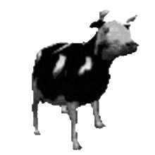

# Vibin

For when your last 2 brain cells need to vibe together at 4am.





---

## Usage

1. Take a deep breath
2. Choose your favorite gif and audio. Recommendations :
    * Gif that loops : [example collection](https://github.com/Gui-Yom/vibin/tree/master/gifs)
    * Audio that destroys your mind, something really catchy. The goal here is for you to attain flow state rapidly.
      Non-exhaustive list :
        * https://youtu.be/Z07z0giGG-w?t=45
        * https://youtu.be/230NWoF-vS4
        * https://youtu.be/9hhMUT2U2L4
        * https://youtu.be/stdyhfeYxxI
        * https://youtu.be/NUYvbT6vTPs
        * https://youtu.be/w0AOGeqOnFY
        * Any Drum & Bass song like https://on.soundcloud.com/BqG4R
3. Obtain a **vibin** executable through the means of [compilation](#build--run)
   or [downloading](https://github.com/Gui-Yom/vibin/releases).
4. Drag your music and your audio over the vibin executable.
5. Your new customized vibin is served hot and fresh
6. Continue doing whatever you were doing
7. ???
8. Profit
9. *Bonus points* if people judge you for using this dark method.

## Controls

- The window is freely movable by dragging it.
- Left click to pause audio
- Mouse wheel to adjust volume
- Middle mouse button to close it

## Build & Run

```shell
cargo build --release
target/release/vibin <mp3 or ogg file>
```

## Build & Run (with bundled audio)

```shell
set VIBIN_BUNDLE=<mp3 or ogg file>
cargo build --release --features bundle-audio
target/release/vibin
```

## Build & Run (with bundled audio and custom gif)

```shell
set VIBIN_GIF=<gif file>
set VIBIN_BUNDLE=<mp3 or ogg file>
cargo build --release --no-default-features --features bundle-audio
target/release/vibin
```

---

https://www.reddit.com/r/ProgrammerHumor/comments/jtnrlk/everyone_loves_pointers_right/
